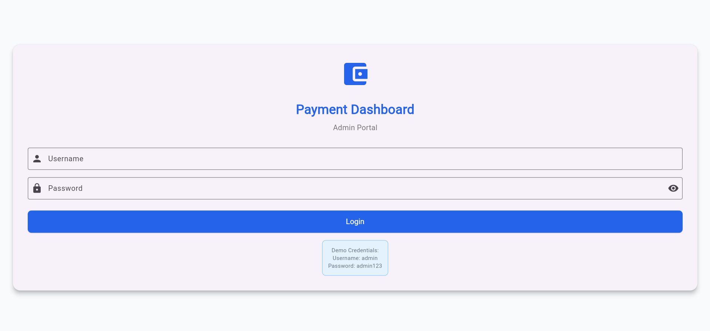
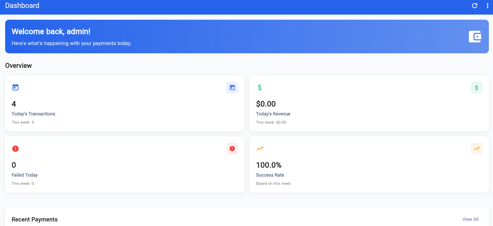
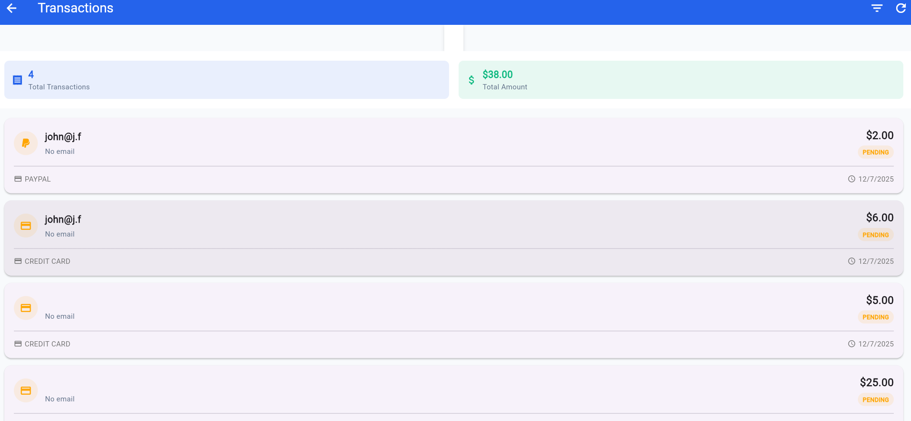
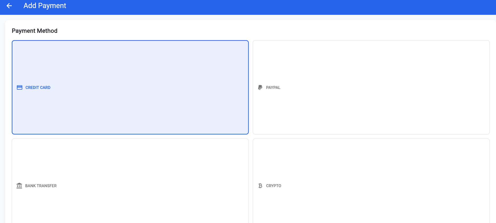

# Showpay

Link to the web version of the frontend: https://showpay-web.vercel.app/

Sample login credentials are on the login page

**Note that since the backend is on a free instance of Render, it may take around a minute to spin up. So if you're using the above link, you may need to attempt login multiple times.**

- **Frontend**: Flutter (this repo)
- **Backend**: NestJS (https://github.com/Neurexx/showpay-backend)


## 📸 Screenshots


     


## 🚀 Setup Locally

### Frontend
Make sure Flutter is set up on your pc

```bash
git clone https://github.com/Neurexx/showpay.git
cd showpay
```
Change baseUrl in lib/utils/constants.dart to 'http://localhost:3000'
```bash
flutter run
```


### Backend
```bash
git clone https://github.com/Neurexx/showpay-backend.git
cd showpay-backend
npm i
```
Create a .env file and fill it with the necessary environment variables as present in src/app.module.ts
```bash 
npm run start:dev
```

## DB Schema

```bash
CREATE TYPE user_role AS ENUM ('admin', 'viewer');
CREATE TYPE payment_status AS ENUM ('pending', 'success', 'failed');
CREATE TYPE payment_method AS ENUM ('credit_card', 'paypal', 'bank_transfer', 'crypto');

CREATE TABLE users (
    id SERIAL PRIMARY KEY,
    username VARCHAR(255) UNIQUE NOT NULL,
    email VARCHAR(255) UNIQUE NOT NULL,
    password_hash VARCHAR(255) NOT NULL,
    role user_role DEFAULT 'viewer',
    created_at TIMESTAMP DEFAULT CURRENT_TIMESTAMP,
    updated_at TIMESTAMP DEFAULT CURRENT_TIMESTAMP
);

CREATE TABLE payments (
    id SERIAL PRIMARY KEY,
    amount DECIMAL(10, 2) NOT NULL,
    currency VARCHAR(10) DEFAULT 'USD',
    payment_method payment_method NOT NULL,
    status payment_status DEFAULT 'pending',
    receiver_name VARCHAR(255) NOT NULL,
    receiver_email VARCHAR(255),
    description TEXT,
    transaction_id VARCHAR(255) UNIQUE NOT NULL,
    created_at TIMESTAMP DEFAULT CURRENT_TIMESTAMP,
    updated_at TIMESTAMP DEFAULT CURRENT_TIMESTAMP
);
```
